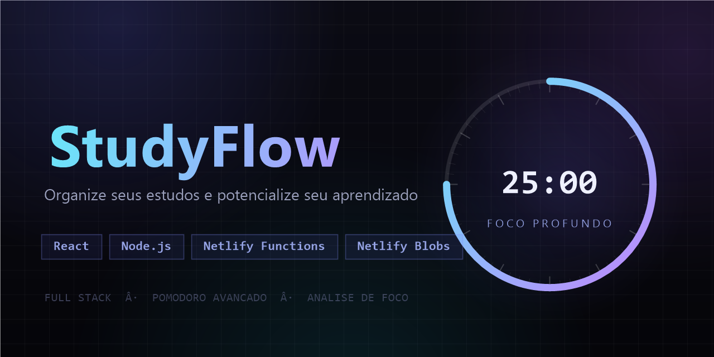

# StudyFlow 📚🚀



O **StudyFlow** é uma aplicação **Full Stack** desenvolvida para ajudar estudantes a organizarem suas rotinas de estudos, gerenciarem tarefas pendentes e manterem o foco com um **Método Pomodoro Avançado**, painel de análise de foco e histórico de sessões persistido na nuvem — tudo em um **deploy unificado na Netlify**.

## ✨ Funcionalidades

* **Interface "Centro de Comando":** Dark mode sofisticado com temporizador holográfico, anel de progresso luminoso, logotipo vetorial próprio e iluminação ambiente reativa ao modo ativo.
* **Gerenciamento de Tarefas:** Adicione, marque como concluída ou exclua tarefas de estudo facilmente.
* **🍅 Método Pomodoro Avançado:**
  * Ciclo completo seguindo o padrão original: Foco (25 min) ➔ Pausa Curta (5 min) ➔ Pausa Longa (15 min a cada 4 pomodoros).
  * Transição automática entre os modos e contador de pomodoros com indicadores visuais do ciclo.
  * Notificações do navegador e alertas sonoros discretos via Web Audio API.
  * Controle segmentado de modos (Foco / Pausa Curta / Pausa Longa) com luz deslizante animada.
* **📈 Análise de Foco:** Métricas de minutos no dia, total de sessões e média por sessão, com gráfico de barras dos últimos 7 dias.
* **📊 Histórico de Sessões:** Registro das jornadas de foco formatado como registros de dados (log de jornadas).
* **Persistência Completa:** Tarefas e histórico salvos na nuvem via **Netlify Functions + Netlify Blobs**.

## 🏗️ Arquitetura (deploy unificado)

Todo o projeto roda em uma única plataforma (Netlify), sem servidor externo:

| Camada | Tecnologia | Onde roda |
|---|---|---|
| Front-end | React + Vite | CDN global da Netlify |
| Back-end (API REST) | Função serverless Node.js (`netlify/functions/api.mjs`) | Netlify Functions |
| Banco de dados | Netlify Blobs (armazenamento chave-valor persistente) | Netlify |

* As rotas `/api/*` são redirecionadas para a função serverless (`netlify.toml`), evitando CORS por serem mesma origem.
> ℹ️ Por usar o cache edge da Netlify, alterações podem levar até ~1 minuto para aparecer em consultas novas. A interface atualiza instantaneamente com estado local, então isso é invisível no uso normal.

### 🔌 Endpoints da API

| Método | Rota | Descrição |
|---|---|---|
| `GET` | `/api/tasks` | Lista todas as tarefas |
| `POST` | `/api/tasks` | Cria tarefa (`{ "title": "..." }`) |
| `PUT` | `/api/tasks/:id` | Alterna conclusão (`{ "completed": 0 \| 1 }`) |
| `DELETE` | `/api/tasks/:id` | Remove tarefa |
| `GET` | `/api/sessions` | Histórico de sessões (mais recentes primeiro) |
| `POST` | `/api/sessions` | Registra sessão (`{ "title", "duration" }`) |

## 🛠️ Tecnologias Utilizadas

* **Frontend:** React, Vite, JavaScript, CSS
* **Backend:** Node.js (Netlify Functions), Netlify Blobs
* **Backend legado (opcional/local):** Node.js, Express, SQLite (`sqlite3`)
* **Controle de Versão:** Git e GitHub

## 📁 Estrutura do Projeto

```
studyflow/
├── client/                  # Front-end React + Vite (publicado pela Netlify)
│   ├── netlify/functions/   # API serverless (roteador único)
│   ├── src/App.jsx          # Interface e lógica do Pomodoro
│   └── netlify.toml         # Configuração de build/funções/redirects
├── server/                  # Backend Express + SQLite (legado/local)
└── netlify.toml             # Configuração principal de deploy da Netlify
```

## 💻 Rodando Localmente

**Somente front-end** (usa a API de produção para leituras):

```bash
cd client
npm install
npm run dev
```

**Stack completa local (serverless):**

```bash
cd client
npm install
npx netlify dev   # sobe front + funções + blobs locais
```

**Backend Express clássico (legado):**

```bash
cd server
npm install
npm start         # API em http://localhost:5000
```

## 🌐 Acesso Online

* **Aplicação completa:** [studyflow-delrey.netlify.app](https://studyflow-delrey.netlify.app/)
